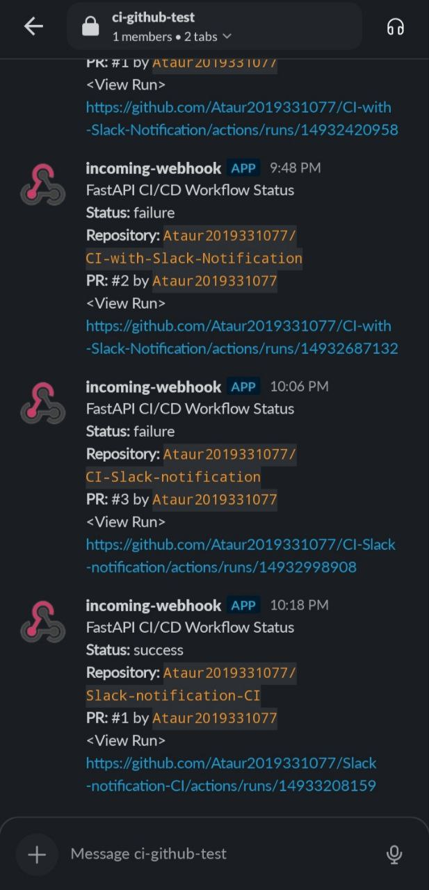

# CI/CD Pipeline with Slack Notifications for FastAPI

This project demonstrates how to build a Continuous Integration/Continuous Deployment (CI/CD) pipeline for a FastAPI application using GitHub Actions, with Slack notifications for test results and automated PR handling.

## 🚀 Features

- Automated testing using `pytest`
- Slack notifications for test results
- Pull Request (PR) comments on test pass/failure
- Auto-merge PRs when all tests pass

## 🧪 Workflow Triggers

- Triggered on pull requests to the `main` branch.

## 🔧 Technologies Used

- **GitHub Actions** for CI/CD automation
- **FastAPI** for the application
- **Slack** for sending notifications
- **pytest** for testing

## 🔁 Workflow Overview

1. Checkout the code
2. Set up Python and install dependencies
3. Run tests
4. Comment on PR based on test results
5. Send Slack notification
6. Auto-merge the PR if tests pass

## 📦 Setup

```bash
pip install fastapi uvicorn pytest httpx
```

Ensure you have a `.github/workflows/ci.yml` GitHub Actions file and necessary secrets (`SLACK_WEBHOOK_URL`) configured in the repository.

## 🔔 Slack Notification Format

- Title: Python CI Result
- Color: Green for success, Red for failure
- Includes commit info and GitHub Actions run link

## Preview


## ✅ Requirements

- GitHub repository
- Slack webhook URL configured as a secret
- FastAPI application
- Test suite using pytest

## 📄 License

This project is open source and available under the [MIT License](LICENSE).
